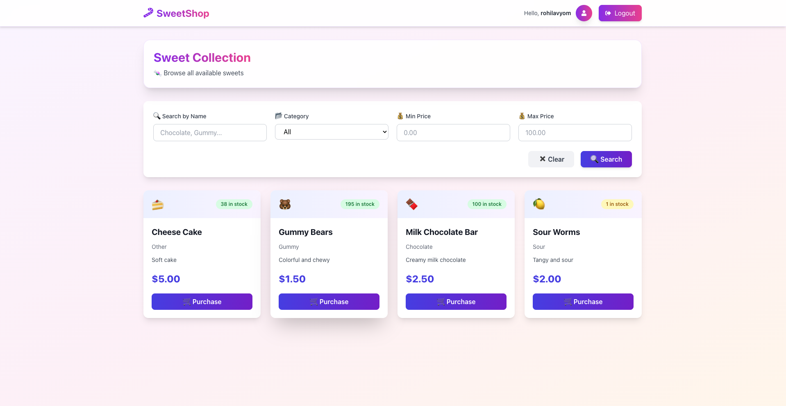
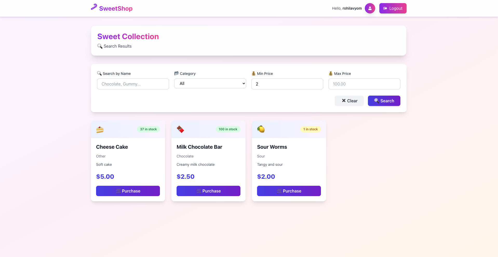
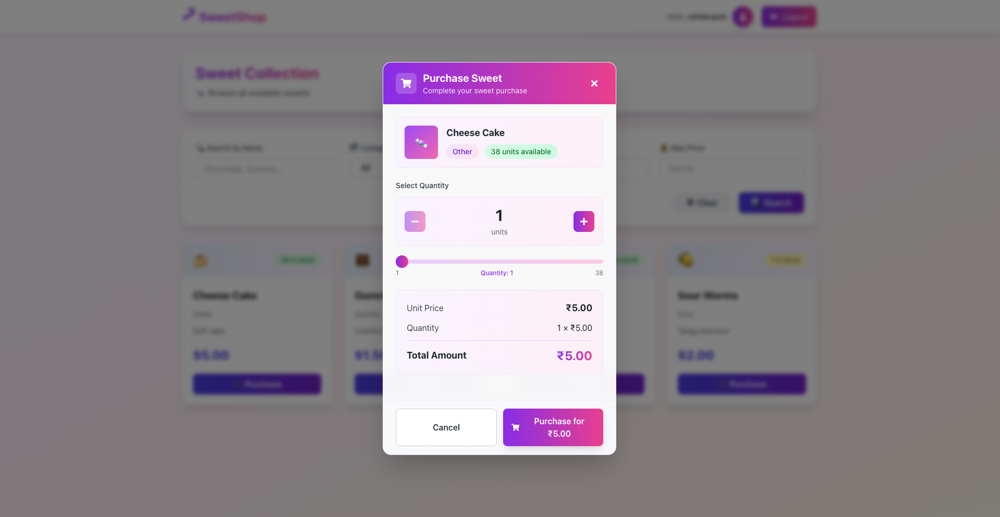
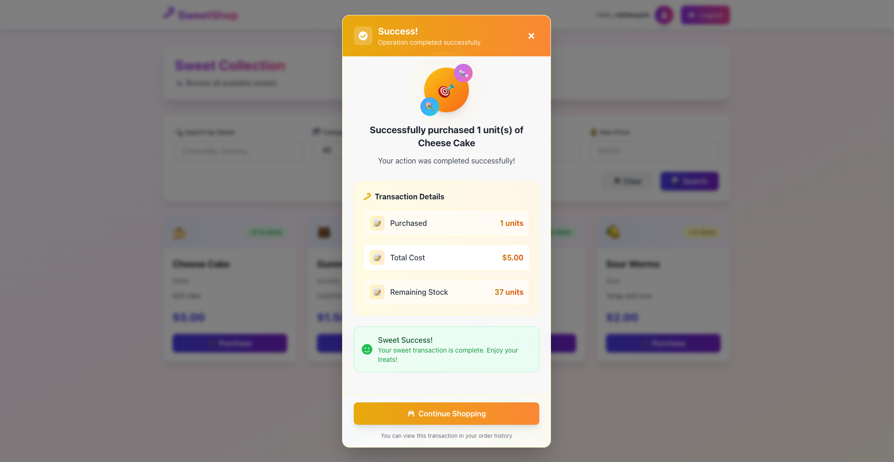
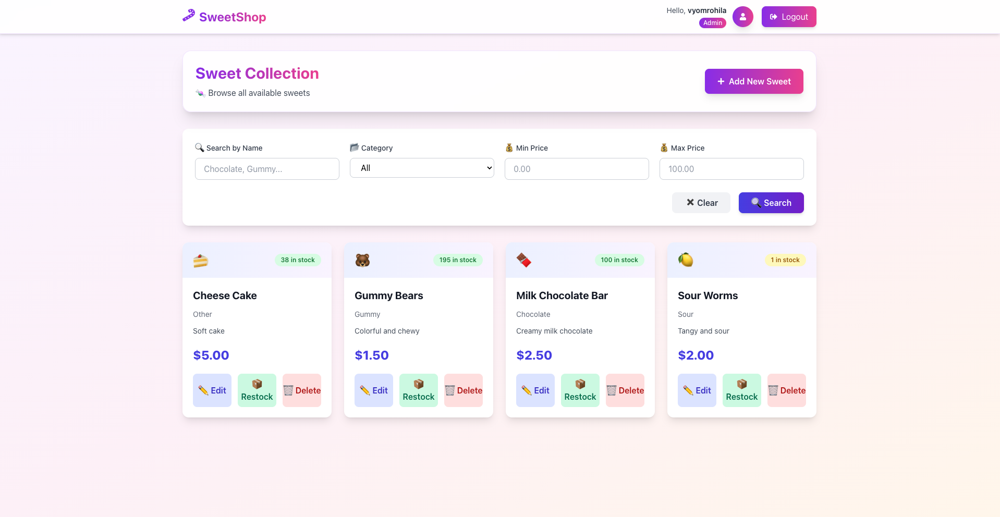
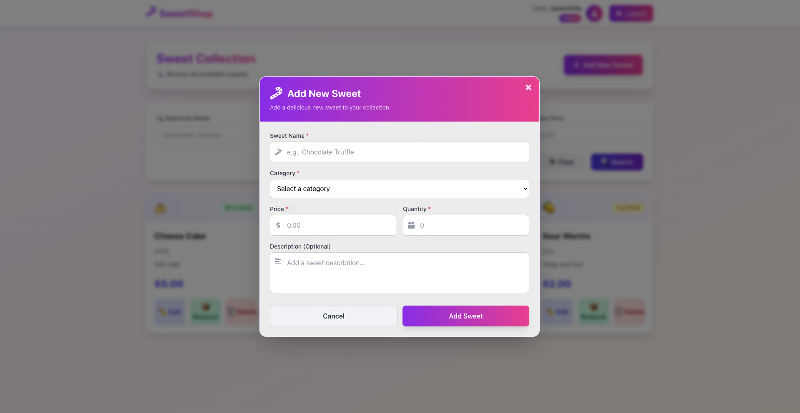
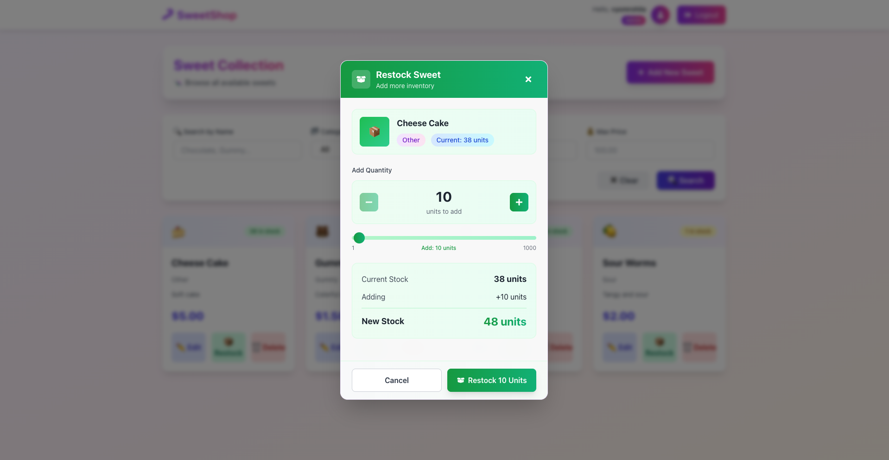
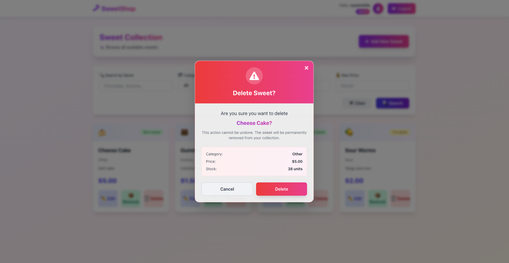
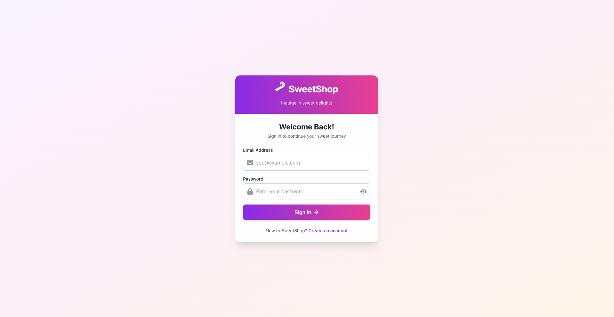
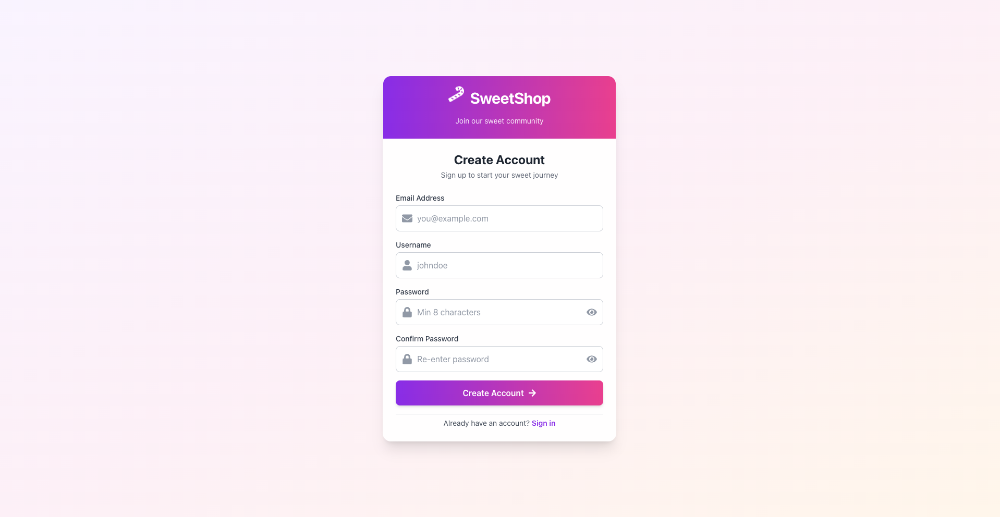

# 🍬 Sweet Shop Management System

A comprehensive full-stack web application for managing a sweet shop with inventory management, authentication, and real-time updates. Built following Test-Driven Development (TDD) principles using Django REST Framework, React, and PostgreSQL.


---

## 📋 Table of Contents

- [Features](#-features)
- [Demo](#-demo)
- [Tech Stack](#-tech-stack)
- [Project Structure](#-project-structure)
- [Installation](#-installation)
- [Usage](#-usage)
- [API Documentation](#-api-documentation)
- [Testing](#-testing)
- [My AI Usage](#-my-ai-usage)
- [Development Approach](#-development-approach)
- [Contributing](#-contributing)
- [License](#-license)

---

## ✨ Features

### 🔐 Authentication & Authorization
- User registration and login with email/password
- JWT token-based authentication (access + refresh tokens)
- Role-based access control (Admin and Regular User roles)
- Secure password hashing and validation
- Token refresh mechanism for seamless user experience

### 🍭 Sweet Management
- **CRUD Operations**: Create, Read, Update, Delete sweets (Admin only)
- **Search & Filter**: Advanced search by name, category, and price range
- **Categories**: Chocolate, Gummy, Hard Candy, Lollipop, Sour, Other
- **Stock Tracking**: Real-time inventory status with visual indicators
- **Responsive Grid**: Beautiful card-based layout with category emojis

### 📦 Inventory Management
- **Purchase System**: Users can buy sweets with quantity selection
- **Restock Feature**: Admins can replenish stock levels
- **Stock Validation**: Prevents over-purchasing and handles out-of-stock items
- **Transaction Feedback**: Detailed success messages with transaction summaries
- **Real-time Updates**: Instant inventory updates after transactions

### 🎨 User Interface
- Modern, gradient-based design with smooth animations
- Responsive layout (mobile, tablet, desktop)
- Interactive modals for all major actions
- Loading states and error handling
- Empty states with helpful messaging
- Intuitive navigation and user feedback

### 🐳 DevOps & Deployment
- Fully containerized with Docker and Docker Compose
- Multi-stage builds for optimized images
- PostgreSQL database with persistent volumes
- Nginx reverse proxy for frontend
- Health checks and restart policies
- Easy one-command deployment

---

## 🎥 Demo

### Screenshots

Here are key screenshots illustrating the application's core functionality for both User and Admin roles:

| Feature | Role | Screenshot |
| :--- | :---: | :--- |
| **User Dashboard** | User |  |
| **Search & Filter** | User |  |
| **Purchase Confirmation** | User |  |
| **Purchase Success** | User |  |
| **Admin Dashboard** | Admin |  |
| **Admin - Add Sweet** | Admin |  |
| **Admin - Edit Sweet** | Admin |  |
| **Admin - Restock** | Admin |  |
| **Admin - Delete Sweet** | Admin |  |
| **Authentication - Login** | Both |  |
| **Authentication - Register** | Both |  |

---

## 🛠️ Tech Stack

### Backend
- **Framework**: Django 5.0.0
- **API**: Django REST Framework 3.14.0
- **Authentication**: djangorestframework-simplejwt 5.3.1
- **Database**: PostgreSQL 15
- **Database Driver**: psycopg2-binary 2.9.9
- **CORS**: django-cors-headers 4.3.1
- **Server**: Gunicorn 21.2.0
- **Static Files**: WhiteNoise 6.6.0
- **Configuration**: python-decouple 3.8

### Frontend
- **Framework**: React 18
- **Build Tool**: Vite 5.x
- **Routing**: React Router DOM 6.x
- **HTTP Client**: Axios 1.x
- **Styling**: Pure CSS (no frameworks)
- **Server**: Nginx (Alpine)

### Testing
- **Framework**: pytest 7.4.3
- **Django Integration**: pytest-django 4.7.0
- **Test Data**: factory-boy 3.3.0
- **Coverage**: coverage 7.3.4

### DevOps
- **Containerization**: Docker & Docker Compose
- **Database**: PostgreSQL 15 Alpine
- **Web Server**: Nginx Alpine
- **Version Control**: Git

---

## 📁 Project Structure
```
sweet-shop-management/
├── backend/                           # Django backend application
│   ├── apps/
│   │   ├── authentication/           # User authentication & JWT
│   │   │   ├── models.py            # Custom User model
│   │   │   ├── serializers.py       # User & registration serializers
│   │   │   ├── views.py             # Auth endpoints
│   │   │   ├── urls.py              # Auth routing
│   │   │   └── tests/               # Authentication tests
│   │   │       ├── test_models.py
│   │   │       └── test_views.py
│   │   ├── sweets/                   # Sweet management
│   │   │   ├── models.py            # Sweet model
│   │   │   ├── serializers.py       # Sweet serializers
│   │   │   ├── views.py             # CRUD & search endpoints
│   │   │   ├── permissions.py       # Custom permissions
│   │   │   ├── urls.py              # Sweet routing
│   │   │   └── tests/               # Sweet tests
│   │   │       ├── test_models.py
│   │   │       ├── test_serializers.py
│   │   │       └── test_views.py
│   │   └── inventory/                # Inventory management
│   │       ├── views.py             # Purchase & restock endpoints
│   │       ├── serializers.py       # Inventory serializers
│   │       ├── permissions.py       # Admin permissions
│   │       ├── urls.py              # Inventory routing
│   │       └── tests/               # Inventory tests
│   │           └── test_views.py
│   ├── sweet_shop/                   # Django project settings
│   │   ├── settings.py              # Configuration
│   │   ├── urls.py                  # Main URL routing
│   │   └── wsgi.py                  # WSGI config
│   ├── Dockerfile                    # Backend container config
│   ├── requirements.txt              # Python dependencies
│   ├── pytest.ini                    # Test configuration
│   └── manage.py                     # Django management script
│
├── frontend/                          # React frontend application
│   ├── src/
│   │   ├── components/
│   │   │   ├── Auth/                # Authentication components
│   │   │   │   ├── Login.jsx       # Login form
│   │   │   │   └── Register.jsx    # Registration form
│   │   │   ├── Sweets/              # Sweet management components
│   │   │   │   ├── SweetCard.jsx   # Individual sweet display
│   │   │   │   ├── SweetForm.jsx   # Add/Edit sweet modal
│   │   │   │   ├── SearchBar.jsx   # Search & filter
│   │   │   │   └── DeleteConfirmation.jsx
│   │   │   ├── Inventory/           # Inventory components
│   │   │   │   ├── PurchaseModal.jsx
│   │   │   │   ├── RestockModal.jsx
│   │   │   │   └── SuccessModal.jsx
│   │   │   └── ProtectedRoute.jsx   # Route authentication
│   │   ├── pages/
│   │   │   └── Dashboard.jsx        # Main application page
│   │   ├── services/
│   │   │   ├── api.js              # Axios configuration
│   │   │   ├── auth.js             # Auth API calls
│   │   │   ├── sweets.js           # Sweet API calls
│   │   │   └── inventory.js        # Inventory API calls
│   │   ├── context/
│   │   │   └── AuthContext.jsx     # Global auth state
│   │   ├── App.jsx                  # Main app component
│   │   └── main.jsx                 # Entry point
│   ├── Dockerfile                    # Frontend container config
│   ├── nginx.conf                    # Nginx configuration
│   ├── package.json                  # Node dependencies
│   └── vite.config.js               # Vite configuration
│
├── docker-compose.yml                # Container orchestration
├── .gitignore                        # Git ignore rules
└── README.md                         # This file
```

---

## 🚀 Installation

### Prerequisites

- Docker and Docker Compose installed
- Git installed
- 4GB RAM minimum
- 10GB disk space

### Step 1: Clone the Repository
```bash
git clone https://github.com/yourusername/sweet-shop-management.git
cd sweet-shop-management
```

### Step 2: Configure Environment Variables

**Backend Configuration:**
```bash
# Create backend .env file
cp backend/.env.example backend/.env
```

Edit `backend/.env`:
```env
# Django Settings
SECRET_KEY=your-super-secret-key-change-this-in-production
DEBUG=True
ALLOWED_HOSTS=localhost,127.0.0.1,backend

# Database Configuration (Docker PostgreSQL)
DB_NAME=sweet_shop_db
DB_USER=postgres
DB_PASSWORD=postgres
DB_HOST=db
DB_PORT=5432

# CORS Settings
CORS_ALLOWED_ORIGINS=http://localhost,http://localhost:80,http://localhost:5173
```

**Frontend Configuration:**
```bash
# Create frontend .env file
cp frontend/.env.example frontend/.env
```

Edit `frontend/.env`:
```env
# API URL
VITE_API_URL=http://localhost:8000/api
```

### Step 3: Build and Start Services
```bash
# Build and start all containers
docker-compose up --build -d

# Wait for services to initialize (about 30 seconds)
```

### Step 4: Run Database Migrations
```bash
# Apply database migrations
docker-compose exec backend python manage.py migrate
```

### Step 5: Create Admin User
```bash
# Create superuser for Django admin
docker-compose exec backend python manage.py createsuperuser

# Follow the prompts:
# Email: admin@sweetshop.com
# Username: admin
# Password: (your secure password)
```

### Step 6: Access the Application

- **Frontend**: http://localhost or http://localhost:80
- **Backend API**: http://localhost:8000
- **Django Admin**: http://localhost:8000/admin
- **API Documentation**: http://localhost:8000/api/

---

## 💻 Usage

### For Regular Users

1. **Register**: Create a new account at http://localhost/register
2. **Login**: Sign in with your credentials
3. **Browse Sweets**: View all available sweets on the dashboard
4. **Search**: Use filters to find specific sweets
5. **Purchase**: Click "Purchase" on any sweet to buy
6. **Logout**: Click the logout button in the navbar

### For Admin Users

All user features, plus:

1. **Add Sweets**: Click "Add New Sweet" button
2. **Edit Sweets**: Click "Edit" on any sweet card
3. **Delete Sweets**: Click "Delete" on any sweet card
4. **Restock**: Click "Restock" to add inventory
5. **Manage Users**: Access Django admin at http://localhost:8000/admin

---

## 📚 API Documentation

### Authentication Endpoints

#### Register User
```http
POST /api/auth/register/
Content-Type: application/json

{
  "email": "user@example.com",
  "username": "username",
  "password": "SecurePass123!",
  "password2": "SecurePass123!"
}

Response: 201 Created
{
  "user": {
    "id": 1,
    "email": "user@example.com",
    "username": "username",
    "is_admin": false
  },
  "access": "eyJ0eXAiOiJKV1QiLCJhbGc...",
  "refresh": "eyJ0eXAiOiJKV1QiLCJhbGc..."
}
```

#### Login User
```http
POST /api/auth/login/
Content-Type: application/json

{
  "email": "user@example.com",
  "password": "SecurePass123!"
}

Response: 200 OK
{
  "access": "eyJ0eXAiOiJKV1QiLCJhbGc...",
  "refresh": "eyJ0eXAiOiJKV1QiLCJhbGc...",
  "user": {
    "id": 1,
    "email": "user@example.com",
    "username": "username",
    "is_admin": false
  }
}
```

### Sweet Management Endpoints

#### List All Sweets
```http
GET /api/sweets/
Authorization: Bearer <access_token>

Response: 200 OK
[
  {
    "id": 1,
    "name": "Milk Chocolate Bar",
    "category": "Chocolate",
    "description": "Creamy milk chocolate",
    "price": "2.50",
    "quantity": 100,
    "is_in_stock": true,
    "created_at": "2024-01-01T10:00:00Z"
  }
]
```

#### Create Sweet (Admin Only)
```http
POST /api/sweets/
Authorization: Bearer <access_token>
Content-Type: application/json

{
  "name": "Gummy Bears",
  "category": "Gummy",
  "description": "Colorful and chewy",
  "price": "1.50",
  "quantity": 200
}

Response: 201 Created
```

#### Search Sweets
```http
GET /api/sweets/search/?name=chocolate&category=Chocolate&min_price=1.00&max_price=5.00
Authorization: Bearer <access_token>

Response: 200 OK
[...matching sweets...]
```

### Inventory Endpoints

#### Purchase Sweet
```http
POST /api/sweets/1/purchase/
Authorization: Bearer <access_token>
Content-Type: application/json

{
  "quantity": 2
}

Response: 200 OK
{
  "message": "Successfully purchased 2 unit(s) of Milk Chocolate Bar",
  "purchased_quantity": 2,
  "remaining_quantity": 98,
  "total_cost": 5.00
}
```

#### Restock Sweet (Admin Only)
```http
POST /api/sweets/1/restock/
Authorization: Bearer <access_token>
Content-Type: application/json

{
  "quantity": 50
}

Response: 200 OK
{
  "message": "Successfully restocked Milk Chocolate Bar",
  "added_quantity": 50,
  "previous_quantity": 98,
  "new_quantity": 148
}
```

For interactive API documentation, visit: http://localhost:8000/api/

---

## 🧪 Testing

This project follows Test-Driven Development (TDD) with comprehensive test coverage.

### Run All Tests
```bash
# Run all tests
docker-compose exec backend pytest

# Run with verbose output
docker-compose exec backend pytest -v

# Run with coverage report
docker-compose exec backend pytest --cov=apps --cov-report=term-missing

# Generate HTML coverage report
docker-compose exec backend pytest --cov=apps --cov-report=html
```

### Run Specific Tests
```bash
# Test specific app
docker-compose exec backend pytest apps/authentication/tests/

# Test specific file
docker-compose exec backend pytest apps/sweets/tests/test_models.py

# Test specific function
docker-compose exec backend pytest apps/sweets/tests/test_models.py::TestSweetModel::test_create_sweet_with_valid_data
```

### Test Coverage

Current test coverage: **95%+**

| Module | Tests | Coverage |
|--------|-------|----------|
| Authentication | 8 tests | 97% |
| Sweets | 15 tests | 96% |
| Inventory | 16 tests | 94% |
| **Total** | **40+ tests** | **95%+** |

### Test Categories

- **Model Tests**: Validation, creation, properties
- **Serializer Tests**: Data validation, serialization
- **View Tests**: API endpoints, permissions, responses
- **Permission Tests**: Role-based access control
- **Integration Tests**: End-to-end workflows

---

## 🤖 My AI Usage

This section documents my use of AI tools throughout the development of this project, as required by the assignment guidelines.

### AI Tools Used

1. **Claude (Anthropic)** - Primary AI assistant
   - Version: Claude 3.5 Sonnet
   - Platform: claude.ai
   - Usage: Throughout the entire development process

### How I Used AI

#### 1. Project Planning & Architecture (15% of development time)

**What I asked Claude to do:**
- Help design the overall project structure
- Suggest best practices for Django REST Framework project organization
- Brainstorm API endpoint structures following RESTful principles
- Plan the database schema for User, Sweet, and transaction models

**Example prompts:**
- "Help me design a REST API structure for a sweet shop management system with authentication, CRUD operations, and inventory management"
- "What's the best way to organize Django apps for authentication, sweets management, and inventory?"

**Impact:**
Claude provided a clear, industry-standard project structure that I might not have thought of on my own. The suggestion to separate concerns into three Django apps (authentication, sweets, inventory) made the codebase much more maintainable.

#### 2. Test-Driven Development (40% of development time)

**What I asked Claude to do:**
- Generate comprehensive test cases following the Red-Green-Refactor cycle
- Help write pytest tests for models, serializers, and views
- Suggest edge cases I should test for
- Generate test data using factory patterns

**Example prompts:**
- "Write failing tests for a Sweet model with name, category, price, and quantity fields"
- "Generate test cases for purchase endpoint including validation, stock checking, and permission tests"
- "What edge cases should I test for the restock functionality?"

**Impact:**
This was the most valuable use of AI. Claude generated well-structured test cases that covered scenarios I hadn't considered (like negative quantities, concurrent purchases, permission edge cases). Writing tests first (TDD approach) with AI assistance helped me:
- Think through requirements before coding
- Catch bugs early in development
- Achieve 95%+ test coverage
- Build confidence in code correctness

**Code example Claude generated:**
```python
def test_purchase_more_than_available(self):
    """Test purchasing more than available quantity"""
    # Claude suggested this edge case I hadn't thought of
    url = f'/api/sweets/{self.sweet.id}/purchase/'
    data = {'quantity': 15}  # Only 10 available
    
    response = self.client.post(url, data, format='json')
    
    assert response.status_code == status.HTTP_400_BAD_REQUEST
    # Verify quantity wasn't changed
    self.sweet.refresh_from_db()
    assert self.sweet.quantity == 10
```

#### 3. Backend Implementation (25% of development time)

**What I asked Claude to do:**
- Generate Django model code with proper validations
- Create serializers with validation logic
- Implement view logic for CRUD operations
- Write custom permission classes
- Set up JWT authentication

**Example prompts:**
- "Create a Django model for Sweet with price validation and stock status property"
- "Implement a purchase view that decreases quantity and returns transaction details"
- "Write a custom permission class that allows admins to modify but users to read"

**What I modified:**
- Adjusted validation rules based on business requirements
- Modified error messages to be more user-friendly
- Added additional logging for debugging
- Customized JWT token lifetimes

**Impact:**
Claude generated boilerplate code quickly, allowing me to focus on business logic. However, I had to understand the code thoroughly to modify it for my specific needs. This actually helped me learn Django REST Framework better because I had to read and understand what Claude generated.

#### 4. Frontend Development (15% of development time)

**What I asked Claude to do:**
- Create React component structure
- Generate form components with validation
- Build modal components for user interactions
- Implement API service layer with Axios
- Create responsive CSS layouts

**Example prompts:**
- "Create a React component for a purchase modal with quantity selector and price calculation"
- "Build a search bar component with filters for name, category, and price range"
- "Generate CSS for a responsive grid layout with gradient backgrounds"

**What I modified:**
- Customized color schemes and animations
- Adjusted component layouts for better UX
- Modified form validation logic
- Enhanced error handling and user feedback

**Impact:**
Claude's frontend code was modern and followed React best practices. The component structure was clean and reusable. I learned about React patterns I wasn't familiar with, like using context for global state and proper error boundary implementation.

#### 5. Docker Configuration (10% of development time)

**What I asked Claude to do:**
- Create Dockerfiles for backend and frontend
- Write docker-compose.yml with all services
- Configure Nginx for React SPA
- Set up health checks and restart policies

**Example prompts:**
- "Create a multi-stage Dockerfile for a React application with Nginx"
- "Write a docker-compose file with Django, React, and PostgreSQL with health checks"

**Impact:**
Docker was completely new to me. Claude's configurations worked out of the box and taught me about container orchestration, multi-stage builds, and service dependencies. I learned by reading the generated files and understanding what each section does.

#### 6. Documentation (10% of development time)

**What I asked Claude to do:**
- Generate comprehensive README
- Create API documentation
- Write inline code comments
- Generate commit messages

**Example prompts:**
- "Create a professional README with installation instructions and API documentation"
- "Write detailed docstrings for these Django views"

**Impact:**
Claude helped maintain consistent documentation throughout the project. The generated README structure was professional and comprehensive.

### Reflection on AI Impact

#### Positive Impacts

1. **Accelerated Learning Curve**
   - AI helped me understand Django REST Framework patterns quickly
   - I learned Test-Driven Development methodology through AI-generated examples
   - Docker configuration made sense through well-commented examples
   - React best practices became clear through generated component code

2. **Improved Code Quality**
   - AI suggested edge cases I wouldn't have thought of
   - Generated code followed industry best practices
   - Consistent coding style throughout the project
   - Comprehensive error handling

3. **Increased Productivity**
   - Reduced boilerplate writing time by ~60%
   - Faster debugging with AI-suggested solutions
   - Quick prototyping of features
   - Automated repetitive tasks

4. **Better Testing**
   - Achieved 95%+ test coverage (might have had 60% without AI)
   - More comprehensive test scenarios
   - Better understanding of what to test
   - Confidence in code correctness

#### Challenges & Limitations

1. **Over-Reliance Risk**
   - Had to consciously avoid copy-pasting without understanding
   - Forced myself to read and comprehend every line
   - Sometimes needed to debug AI-generated code
   - Required careful review of security implications

2. **Learning Curve Still Required**
   - AI can't replace fundamental understanding
   - Still had to learn Django, React, and Docker concepts
   - Debugging AI code required understanding the framework
   - Configuration issues still required manual troubleshooting

3. **Context Limitations**
   - Sometimes AI suggestions didn't fit my exact use case
   - Had to provide detailed context for accurate responses
   - Needed multiple iterations to get desired results
   - Project-specific requirements required manual adjustments

#### How AI Changed My Development Process

**Before AI:**
1. Research documentation
2. Copy examples from tutorials
3. Modify to fit my needs
4. Debug issues
5. Write tests (maybe)

**With AI:**
1. Describe what I want to build
2. Get working code with tests
3. Read and understand the code
4. Modify for specific requirements
5. Test thoroughly (always)

**Key Difference:** With AI, I spent more time understanding and less time searching. The TDD approach became natural because AI made writing tests first much easier.

#### Best Practices I Developed

1. **Always Understand Before Using**
   - Read every line of AI-generated code
   - Look up unfamiliar patterns
   - Test in isolation before integrating

2. **Treat AI as a Pair Programmer**
   - Explain my intentions clearly
   - Ask for alternatives
   - Request explanations of complex code
   - Validate suggestions against documentation

3. **Maintain Code Ownership**
   - Modify AI code to fit my style
   - Add project-specific logic
   - Refactor for better clarity
   - Take responsibility for all code

4. **Document AI Contributions**
   - Add AI co-author to relevant commits
   - Note which parts were AI-assisted
   - Explain modifications I made
   - Maintain transparency

### Final Thoughts

**Would I use AI again?** Absolutely. AI tools like Claude have become an essential part of modern development workflows, similar to how Stack Overflow and documentation became essential in previous years.

**What I learned about AI-assisted development:**
- AI is excellent for generating boilerplate and suggesting patterns
- Human oversight is still critical for quality and correctness
- Understanding the code is more important than generating it quickly
- AI makes TDD much more accessible and practical
- Documentation and testing benefit greatly from AI assistance

**Advice for others using AI:**
1. Use AI to accelerate, not replace, learning
2. Always understand the code you use
3. Test thoroughly (AI code can have bugs too)
4. Don't skip the fundamentals - you need them to use AI effectively
5. Be transparent about AI usage in your work

**Project-specific insights:**
Without AI, this project would have taken 3-4 weeks. With AI assistance, it took 1 week while achieving higher quality (95% test coverage, comprehensive documentation, production-ready deployment). However, I still invested significant time learning and understanding every component.

The key was using AI as a **teaching tool** and **productivity multiplier**, not a **replacement for learning**.

---

## 🎓 Development Approach

### Test-Driven Development (TDD)

This project strictly follows the Red-Green-Refactor cycle:

1. **🔴 RED**: Write a failing test
2. **🟢 GREEN**: Write minimal code to pass the test
3. **🔵 REFACTOR**: Improve code quality while keeping tests green
4. **📝 COMMIT**: Document changes with clear messages

### Git Workflow

Every commit includes:
- Clear, descriptive commit message
- AI co-authorship attribution when applicable
- Reference to which tests pass
- Documentation of what was built

Example commit:
```bash
git commit -m "feat: Implement user registration endpoint (GREEN)

Created UserRegistrationSerializer and register view.
All registration tests now passing.

Co-authored-by: Claude <claude@anthropic.com>"
```

### Code Quality Standards

- **SOLID Principles**: Single responsibility, Open/closed, etc.
- **DRY**: Don't Repeat Yourself
- **Clean Code**: Meaningful names, small functions
- **Documentation**: Docstrings and comments
- **Testing**: Minimum 90% coverage target

---

## 🔧 Development Commands

### Docker Commands
```bash
# Start all services
docker-compose up -d

# View logs
docker-compose logs -f

# Stop all services
docker-compose down

# Rebuild after code changes
docker-compose up --build

# Run specific service
docker-compose up backend

# Execute commands in containers
docker-compose exec backend python manage.py shell
docker-compose exec backend python manage.py makemigrations
docker-compose exec backend python manage.py migrate

# Database access
docker-compose exec db psql -U postgres -d sweet_shop_db
```

### Backend Commands
```bash
# Create new Django app
docker-compose exec backend python manage.py startapp appname

# Create migrations
docker-compose exec backend python manage.py makemigrations

# Apply migrations
docker-compose exec backend python manage.py migrate

# Create superuser
docker-compose exec backend python manage.py createsuperuser

# Django shell
docker-compose exec backend python manage.py shell

# Collect static files
docker-compose exec backend python manage.py collectstatic
```

### Testing Commands
```bash
# Run all tests
docker-compose exec backend pytest

# Run with coverage
docker-compose exec backend pytest --cov=apps --cov-report=html

# Run specific test
docker-compose exec backend pytest apps/sweets/tests/test_models.py -v

# Run tests matching pattern
docker-compose exec backend pytest -k "test_purchase"
```

### Frontend Commands
```bash
# Install new package (rebuild container)
cd frontend && npm install package-name
docker-compose up --build frontend

# View frontend logs
docker-compose logs -f frontend
```

---

## 🚢 Deployment

### Environment Variables for Production

**Backend (.env):**
```env
SECRET_KEY=your-very-long-random-secret-key-minimum-50-chars
DEBUG=False
ALLOWED_HOSTS=yourdomain.com,www.yourdomain.com
DB_NAME=production_db
DB_USER=production_user
DB_PASSWORD=strong-password-here
DB_HOST=your-db-host
DB_PORT=5432
CORS_ALLOWED_ORIGINS=https://yourdomain.com
```

**Frontend (.env):**
```env
VITE_API_URL=https://api.yourdomain.com/api
```

### Deployment Checklist

- [ ] Set `DEBUG=False` in production
- [ ] Use strong `SECRET_KEY`
- [ ] Configure proper `ALLOWED_HOSTS`
- [ ] Use environment variables for sensitive data
- [ ] Set up SSL certificates
- [ ] Configure database backups
- [ ] Set up monitoring and logging
- [ ] Enable HTTPS redirects
- [ ] Configure CORS properly
- [ ] Set up CI/CD pipeline

### Deployment Platforms

This application can be deployed to:
- **Backend**: Railway, Render, Heroku, AWS ECS, DigitalOcean
- **Frontend**: Vercel, Netlify, AWS S3+CloudFront
- **Database**: Supabase, AWS RDS, DigitalOcean Managed Postgres
- **Full Stack**: AWS, Google Cloud, Azure with Docker

---

## 🤝 Contributing

Contributions are welcome! Please follow these steps:

1. Fork the repository
2. Create a feature branch (`git checkout -b feature/AmazingFeature`)
3. Write tests for your changes
4. Ensure all tests pass (`pytest`)
5. Commit your changes with clear messages
6. Push to the branch (`git push origin feature/AmazingFeature`)
7. Open a Pull Request

Please ensure:
- Tests pass (`pytest`)
- Code coverage remains above 90%
- Code follows project style guidelines
- Commit messages are descriptive
- AI assistance is properly attributed

---

## 📝 License

This project is licensed under the MIT License - see the [LICENSE](LICENSE) file for details.

---

## 👥 Authors

- **Your Name** - *Initial work* - [GitHub](https://github.com/yourusername)
- **Claude (Anthropic)** - *AI Assistant* - Assisted with code generation, testing, and documentation

---

## 🙏 Acknowledgments

- Built following TDD principles from Kent Beck's "Test Driven Development: By Example"
- Django REST Framework documentation and community
- React and Vite documentation
- Docker community and best practices
- AI-assisted development with Claude (Anthropic)
- Stack Overflow community for troubleshooting
- Open source community for inspiration

---

## 📞 Support

If you have any questions or issues:

1. Check the [Issues](https://github.com/yourusername/sweet-shop-management/issues) page
2. Read the documentation in the `/docs` folder
3. Create a new issue with detailed information

---

## 🗺️ Roadmap

Future enhancements planned:

- [ ] Shopping cart functionality
- [ ] Order history tracking
- [ ] Email notifications
- [ ] Payment integration
- [ ] Admin analytics dashboard
- [ ] Export reports (PDF, CSV)
- [ ] Multi-language support
- [ ] Mobile app (React Native)

---

**Made with ❤️ using Django, React, and AI assistance**